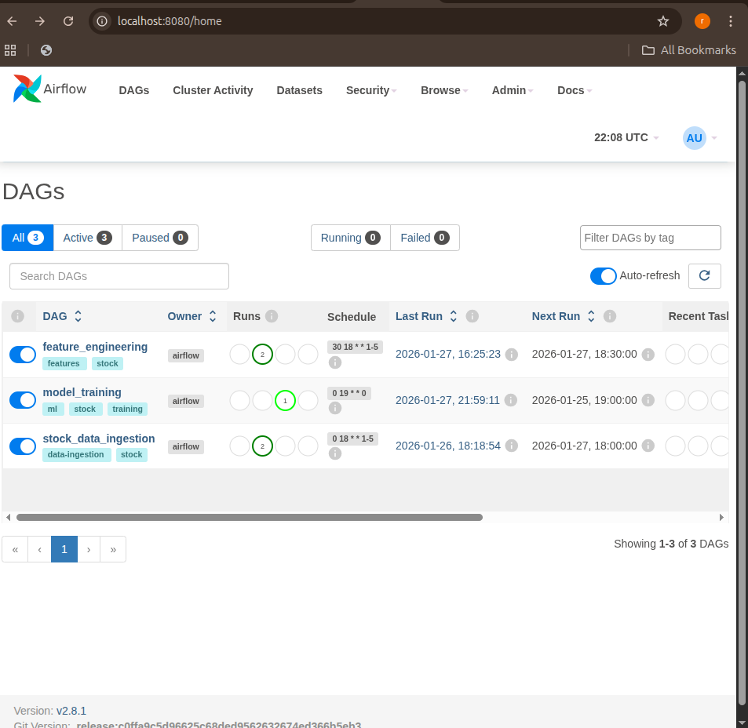
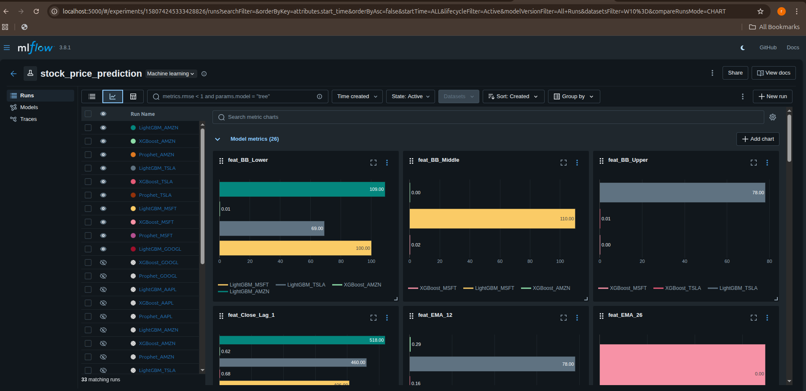

# Stock Price Prediction with MLOps Pipeline

An end-to-end automated machine learning pipeline for stock price prediction using Airflow, MLflow, and Docker. The system fetches real-time stock data, engineers technical indicators, trains multiple ML models, and tracks all experiments.

## 🎯 Project Overview

This project demonstrates a production-ready MLOps pipeline that:
- **Automatically fetches** stock data daily from Yahoo Finance
- **Engineers 20+ technical indicators** (RSI, MACD, Bollinger Bands, etc.)
- **Trains and compares** 3 ML models (Prophet, XGBoost, LightGBM)
- **Tracks all experiments** with MLflow
- **Orchestrates workflows** using Apache Airflow
- **Containerized** with Docker for reproducibility

## 📊 Key Results

| Model | Best MAPE | Best Stock | Prediction Accuracy |
|-------|-----------|------------|---------------------|
| **LightGBM** | **5.16%** | AAPL | **94.84%** |
| **XGBoost** | 6.37% | AAPL | 93.63% |
| **Prophet** | 11.00% | AAPL | 89.00% |

**Winner: LightGBM** achieves the lowest prediction error across all stocks.

## 🏗️ Architecture
```
┌─────────────────────────────────────────────────────────────┐
│                     Apache Airflow                           │
│  ┌─────────────────┐  ┌──────────────┐  ┌────────────────┐ │
│  │ Data Ingestion  │→ │   Feature    │→ │ Model Training │ │
│  │   (Daily 6PM)   │  │ Engineering  │  │ (Weekly Sun)   │ │
│  │                 │  │ (Daily 6:30) │  │                │ │
│  └─────────────────┘  └──────────────┘  └────────────────┘ │
└─────────────────────────────────────────────────────────────┘
                              ↓
                    ┌─────────────────────┐
                    │   MLflow Tracking   │
                    │  (Experiment Logs)  │
                    └─────────────────────┘
```

## 🛠️ Tech Stack

- **Orchestration:** Apache Airflow 2.8.1
- **Experiment Tracking:** MLflow 2.10.2
- **ML Models:** Prophet, XGBoost, LightGBM
- **Data Processing:** Pandas, NumPy
- **Feature Engineering:** TA-Lib (Technical Analysis)
- **Containerization:** Docker, Docker Compose
- **Data Source:** Yahoo Finance (yfinance)
- **Version Control:** Git, GitHub

## 📁 Project Structure
```
stock-ml-pipeline/
├── dags/                          # Airflow DAGs
│   ├── stock_data_ingestion_dag.py
│   ├── feature_engineering_dag.py
│   └── model_training_dag.py
├── src/
│   ├── data/                      # Data processing
│   │   ├── fetch_stock_data.py
│   │   └── feature_generator.py
│   └── models/                    # ML models
│       ├── train_prophet.py
│       ├── train_xgboost.py
│       ├── train_lightgbm.py
│       └── train_all_models.py
├── data/
│   ├── raw/                       # Raw stock data
│   ├── processed/                 # Engineered features
│   └── predictions/               # Model predictions
├── docker/
│   └── docker-compose.yml         # Container orchestration
├── mlruns/                        # MLflow experiment tracking
├── logs/                          # Airflow logs
└── requirements.txt
```

## 🚀 Getting Started
## 📸 Screenshots

### Airflow DAGs Overview
All three automated workflows for data ingestion, feature engineering, and model training:



### Airflow Pipeline Graph
Model training DAG showing parallel execution of Prophet, XGBoost, and LightGBM:


### MLflow Experiment Tracking
Comparison of 15 trained models across 5 stocks:




### Prerequisites

- Docker & Docker Compose
- Python 3.10+
- 8GB RAM minimum

### Installation

1. **Clone the repository**
```bash
git clone https://github.com/YOUR_USERNAME/stock-ml-pipeline.git
cd stock-ml-pipeline
```

2. **Start Docker containers**
```bash
cd docker
docker-compose up -d
```

3. **Access Airflow UI**
- URL: http://localhost:8080
- Username: `admin`
- Password: `admin`

4. **Access MLflow UI**
- URL: http://localhost:5000

### Running the Pipeline

1. **Enable DAGs** in Airflow UI (toggle switches)
2. **Trigger manually** or wait for scheduled runs:
   - Data Ingestion: Daily at 6 PM
   - Feature Engineering: Daily at 6:30 PM
   - Model Training: Weekly on Sundays at 7 PM

## 📈 Features

### Data Pipeline
- **5 Stocks tracked:** AAPL, GOOGL, MSFT, TSLA, AMZN
- **5 years historical data** (~1,260 trading days per stock)
- **Automated daily updates** from Yahoo Finance

### Feature Engineering (20+ indicators)
- **Trend:** SMA (10, 50, 200), EMA (12, 26)
- **Momentum:** RSI, MACD, MACD Signal
- **Volatility:** Bollinger Bands (Upper, Middle, Lower)
- **Volume:** Volume MA, Volume Change
- **Price:** Returns, Lag features, High-Low Range

### ML Models
1. **Prophet** - Facebook's time-series forecasting
2. **XGBoost** - Gradient boosting (tree-based)
3. **LightGBM** - Fast gradient boosting (winner!)

### MLOps
- **Experiment tracking** with MLflow
- **Model versioning** and comparison
- **Feature importance** analysis
- **Automated retraining** weekly

## 🎓 Key Learnings

1. **LightGBM outperforms** other models for stock prediction
2. **Recent price momentum** (EMA_12, Close_Lag_1) = 92% of prediction power
3. **Feature engineering matters** more than model complexity
4. **Automated pipelines** prevent manual errors and save time

## 📊 Model Comparison

View detailed experiment comparisons in MLflow:
- Navigate to http://localhost:5000
- Select "stock_price_prediction" experiment
- Compare metrics across all runs

## 🔄 Automation Schedule

| DAG | Schedule | Purpose |
|-----|----------|---------|
| stock_data_ingestion | Daily 6 PM (Mon-Fri) | Fetch latest stock prices |
| feature_engineering | Daily 6:30 PM (Mon-Fri) | Generate technical indicators |
| model_training | Weekly Sunday 7 PM | Retrain all models |

## 🐛 Troubleshooting

**Airflow DAGs not showing:**
```bash
docker-compose restart airflow-scheduler
```

**MLflow not accessible:**
```bash
docker-compose logs mlflow
```

**Permission errors:**
```bash
chmod -R 777 data/ logs/ mlruns/
```

## 🚀 Future Enhancements

- [ ] Add prediction API endpoint
- [ ] Create Streamlit dashboard
- [ ] Implement ensemble models
- [ ] Add more stocks and crypto
- [ ] Deploy to cloud (AWS/GCP)
- [ ] Add model drift detection
- [ ] Implement A/B testing

## 📝 License

This project is open source and available under the MIT License.

## 👤 Author

**Your Name**
- GitHub: [rithik-06](https://github.com/rithik-06)
- LinkedIn: [Rithik Tiwari](https://www.linkedin.com/in/rithik-tiwari-347b502b0/)

## 🙏 Acknowledgments

- Yahoo Finance for free stock data API
- Apache Airflow community
- MLflow team at Databricks